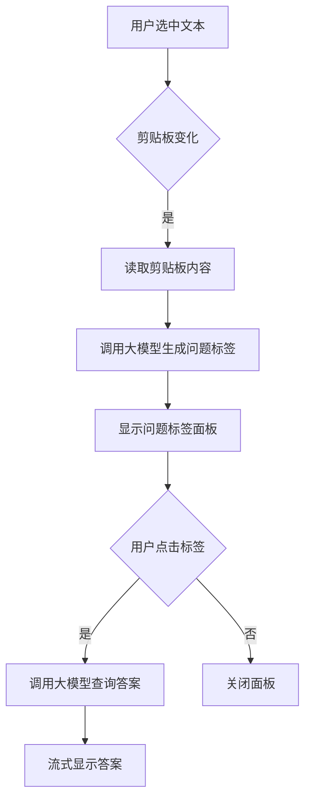
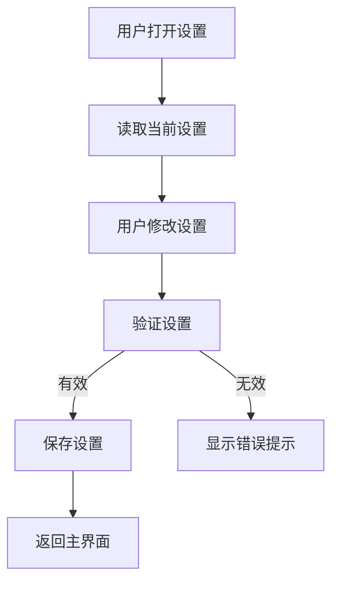

# 智能文本分析工具 - 需求文档

## 1. 需求概述

### 1.1 项目背景
本项目是一款跨平台桌面小工具，核心功能是通过划词/划段落捕获文本，自动生成用户可能关心的问题标签（如"这是什么？"、"干什么用的？"、"怎么用？"等），用户点击问题标签后调用大模型获取简洁回答，帮助用户快速了解陌生知识点，实现"快速扫盲"的目的。

### 1.2 目标用户
- **日常学习者**：阅读时遇到陌生概念，快速了解基本含义
- **学生**：学习过程中快速理解新术语、新概念
- **职场人士**：浏览文档时快速掌握关键信息
- **内容消费者**：阅读新闻、文章时快速了解不熟悉的内容

### 1.3 核心价值主张
- **快速扫盲**：划词即可生成问题，点击获取答案，快速了解陌生知识点
- **问题引导**：自动生成常见问题（是什么、干什么、怎么用），帮助用户明确需求
- **浅度理解**：提供简洁明了的回答，满足快速了解的需求
- **轻量级**：系统托盘驻留，随时可用，不占用桌面空间

---

## 2. 功能需求

### 2.1 核心功能

#### 2.1.1 系统托盘（参考 easydict 设计）
| 需求编号 | 功能点 | 需求描述 | 优先级 |
|---------|-------|---------|-------|
| CF-001 | 托盘图标显示 | 应用启动后最小化到系统托盘，显示应用图标 | 高 |
| CF-002 | 右键菜单 | 右键点击托盘图标显示菜单，包含多个功能入口（参考 easydict） | 高 |
| CF-003 | 快速分析入口 | 菜单包含"分析文本"选项，打开主弹窗 | 高 |
| CF-004 | 历史记录入口 | 菜单包含"历史记录"选项，查看查询历史 | 中 |
| CF-005 | 设置入口 | 菜单包含"设置"选项，打开设置面板 | 中 |
| CF-006 | 检查更新 | 菜单包含"检查更新"选项 | 低 |
| CF-007 | 帮助入口 | 菜单包含"帮助"选项，显示使用说明 | 低 |
| CF-008 | 退出选项 | 菜单包含"退出"选项，关闭应用 | 高 |
| CF-009 | 双击唤醒 | 双击托盘图标显示主界面或快速分析面板 | 中 |
| CF-010 | 通知提示 | 任务完成后显示系统通知（可选） | 中 |

#### 2.1.2 文本捕获
| 需求编号 | 功能点 | 需求描述 | 优先级 |
|---------|-------|---------|-------|
| CF-011 | 剪贴板监听 | 自动监听系统剪贴板变化 | 高 |
| CF-012 | 划词捕获 | 用户选中任意文本后自动捕获 | 高 |
| CF-013 | 全局快捷键 | 支持自定义快捷键触发分析（默认：Cmd/Ctrl+Shift+A） | 高 |

#### 2.1.3 问题标签生成（大模型驱动）
| 需求编号 | 功能点 | 需求描述 | 优先级 |
|---------|-------|---------|-------|
| CF-014 | 自动生成标签 | 根据文本内容自动生成5-8个问题标签，聚焦"快速扫盲"类型问题 | 高 |
| CF-015 | 问题类型导向 | 生成基础入门级问题，如"这是什么？"、"干什么用的？"、"怎么用？"等 | 高 |
| CF-016 | 领域自适应 | 大模型自动识别文本领域，生成适配该领域的基础问题 | 高 |
| CF-017 | 标签展示 | 垂直列表展示问题标签，支持点击 | 高 |
| CF-018 | 标签刷新 | 支持重新生成问题标签 | 中 |

#### 2.1.4 大模型查询
| 需求编号 | 功能点 | 需求描述 | 优先级 |
|---------|-------|---------|-------|
| CF-019 | 点击查询 | 点击问题标签调用大模型获取答案 | 高 |
| CF-020 | 简洁回答 | 大模型返回简洁明了的回答，适合快速了解（约2-3句话） | 高 |
| CF-021 | 流式响应 | 支持答案流式输出，实时显示 | 高 |
| CF-022 | 答案格式化 | 支持 Markdown 格式渲染 | 高 |
| CF-023 | 复制答案 | 支持一键复制答案到剪贴板 | 中 |
| CF-024 | 查询状态 | 显示查询进度和状态提示 | 中 |

### 2.2 扩展功能

#### 2.2.1 全局快捷键配置
| 需求编号 | 功能点 | 需求描述 | 优先级 |
|---------|-------|---------|-------|
| EF-001 | 自定义快捷键 | 用户可自定义各功能的触发快捷键 | 中 |
| EF-002 | 快捷键冲突检测 | 检测并提示快捷键冲突 | 中 |
| EF-003 | 快捷键恢复默认 | 支持恢复默认快捷键设置 | 低 |

#### 2.2.2 历史记录
| 需求编号 | 功能点 | 需求描述 | 优先级 |
|---------|-------|---------|-------|
| EF-004 | 记录保存 | 自动保存查询历史记录 | 中 |
| EF-005 | 历史列表 | 显示历史记录列表，支持分页 | 中 |
| EF-006 | 历史搜索 | 支持关键词搜索历史记录 | 中 |
| EF-007 | 历史详情 | 查看历史记录的完整内容和答案 | 中 |
| EF-008 | 历史删除 | 支持删除单条或批量删除历史记录 | 低 |
| EF-009 | 历史导出 | 支持导出历史记录为文件 | 低 |

#### 2.2.3 设置面板
| 需求编号 | 功能点 | 需求描述 | 优先级 |
|---------|-------|---------|-------|
| EF-010 | API Key 配置 | 配置大模型 API Key | 高 |
| EF-011 | 模型选择 | 支持切换不同大模型（GPT-4、Claude、国产模型等） | 中 |
| EF-012 | 主题设置 | 支持明暗主题切换 | 低 |
| EF-013 | 通知设置 | 控制是否显示系统通知 | 低 |
| EF-014 | 数据清理 | 清除缓存和历史记录 | 低 |

#### 2.2.4 标签模板（可选）
| 需求编号 | 功能点 | 需求描述 | 优先级 |
|---------|-------|---------|-------|
| EF-015 | 预设模板 | 提供常用问题模板（如代码分析、论文解读等） | 低 |
| EF-016 | 自定义模板 | 用户可自定义问题模板 | 低 |
| EF-017 | 模板管理 | 支持添加、编辑、删除模板 | 低 |

#### 2.2.5 多模型支持
| 需求编号 | 功能点 | 需求描述 | 优先级 |
|---------|-------|---------|-------|
| EF-018 | 模型切换 | 支持在不同大模型间切换 | 低 |
| EF-019 | 模型配置 | 配置各模型的 API 参数 | 低 |

### 2.3 平台适配功能

#### 2.3.1 macOS 适配
| 需求编号 | 功能点 | 需求描述 | 优先级 |
|---------|-------|---------|-------|
| PF-001 | 菜单栏集成 | 支持 macOS 菜单栏显示 | 中 |
| PF-002 | 通知中心 | 集成 macOS 通知中心 | 中 |

#### 2.3.2 Windows 适配
| 需求编号 | 功能点 | 需求描述 | 优先级 |
|---------|-------|---------|-------|
| PF-003 | 系统托盘 | 标准 Windows 托盘图标 | 高 |
| PF-004 | 通知气泡 | Windows 通知气泡提示 | 中 |
| PF-005 | 开机自启 | 支持设置开机自动启动 | 中 |

#### 2.3.3 Linux 适配
| 需求编号 | 功能点 | 需求描述 | 优先级 |
|---------|-------|---------|-------|
| PF-006 | AppIndicator 托盘 | Linux 系统托盘支持 | 高 |
| PF-007 | Gnome/KDE 集成 | 适配主流 Linux 桌面环境 | 中 |
| PF-008 | 权限处理 | 正确处理文件系统权限 | 中 |

---

## 3. 非功能需求

### 3.1 性能需求
| 需求编号 | 描述 |
|---------|-----|
| NF-001 | 应用启动时间 < 1 秒 |
| NF-002 | 剪贴板监听响应时间 < 500ms |
| NF-003 | 大模型查询响应时间（首字符）< 2 秒 |
| NF-004 | 内存占用 < 150MB |

### 3.2 安全需求
| 需求编号 | 描述 |
|---------|-----|
| NF-005 | API Key 加密存储，不明文传输 |
| NF-006 | 所有网络请求使用 HTTPS |
| NF-007 | 输入内容验证，防止注入攻击 |
| NF-008 | 最小化系统权限请求 |

### 3.3 兼容性需求
| 需求编号 | 描述 |
|---------|-----|
| NF-009 | 支持 macOS 10.15+ |
| NF-010 | 支持 Windows 10+ |
| NF-011 | 支持 Ubuntu 20.04+、Fedora 34+ |

### 3.4 用户体验需求
| 需求编号 | 描述 |
|---------|-----|
| NF-012 | 界面简洁，操作直观 |
| NF-013 | 支持快捷键操作，提高效率 |
| NF-014 | 提供清晰的错误提示和操作引导 |

---

## 4. 数据需求

### 4.1 数据存储
| 数据类型 | 存储方式 | 说明 |
|---------|---------|-----|
| API Key | 加密存储（本地文件） | 用户配置的大模型 API Key |
| 历史记录 | SQLite 数据库 | 查询历史记录 |
| 设置配置 | JSON 文件 | 用户设置项 |
| 缓存数据 | 内存 + 本地缓存 | 临时数据缓存 |

### 4.2 数据格式
| 数据项 | 格式 | 示例 |
|-------|-----|-----|
| 问题标签 | JSON 数组 | ["问题1", "问题2", "问题3"] |
| 历史记录 | JSON 对象 | {"text": "...", "tags": [...], "answer": "...", "timestamp": 1234567890} |
| 设置配置 | JSON 对象 | {"apiKey": "...", "model": "gpt-4", "language": "zh-CN"} |

---

## 5. 接口需求

### 5.1 大模型 API 接口
| 接口 | 方法 | 参数 | 返回值 |
|-----|-----|-----|-------|
| /api/llm | POST | prompt: string, model?: string, stream?: boolean | { content: string } 或 流式响应 |

### 5.2 历史记录接口
| 接口 | 方法 | 参数 | 返回值 |
|-----|-----|-----|-------|
| /api/history | GET | page?: number, limit?: number | Array<HistoryItem> |
| /api/history | POST | item: HistoryItem | { success: boolean } |
| /api/history/:id | DELETE | id: string | { success: boolean } |
| /api/history/search | GET | keyword: string | Array<HistoryItem> |

### 5.3 设置接口
| 接口 | 方法 | 参数 | 返回值 |
|-----|-----|-----|-------|
| /api/settings | GET | - | Settings |
| /api/settings | PUT | settings: Partial<Settings> | { success: boolean } |

---

## 6. 业务流程

### 6.1 文本分析流程


### 6.2 设置流程


---

## 7. 界面原型说明

### 7.1 系统托盘菜单（参考 easydict）
```
┌─────────────────────────────┐
│  智能文本分析工具            │
├─────────────────────────────┤
│  分析文本                    │
│  历史记录                    │
│  ────────────────────────    │
│  设置...                     │
│  检查更新                    │
│  帮助                        │
│  ────────────────────────    │
│  退出                        │
└─────────────────────────────┘
```

### 7.2 Mini 弹窗主界面（核心界面）
整体采用紧凑的弹窗设计，分为两个主要区域：

**上段 - 问题列表区**
- 垂直列表展示大模型生成的问题标签
- 每个问题标签可点击选中
- 选中状态高亮显示
- 支持刷新重新生成问题

**下段 - 问题编辑与发送区**
- 显示用户点击选中的问题
- 支持编辑和补充问题内容
- 发送按钮触发大模型查询
- 加载状态提示

### 7.3 答案展示区域（内嵌于弹窗）
- 在问题发送后，下方展开答案区域
- 流式显示大模型返回的答案
- 支持一键复制答案
- 支持关闭答案区域

### 7.4 设置面板
- 独立弹窗形式
- 标签页：API 设置、快捷键设置、通用设置
- 表单：输入框、下拉选择、开关按钮
- 操作：保存、恢复默认

---

**文档版本**: v1.0  
**创建日期**: 2026-06-09  
**适用项目**: 智能文本分析工具